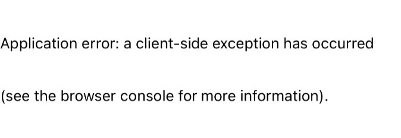
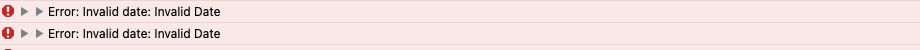
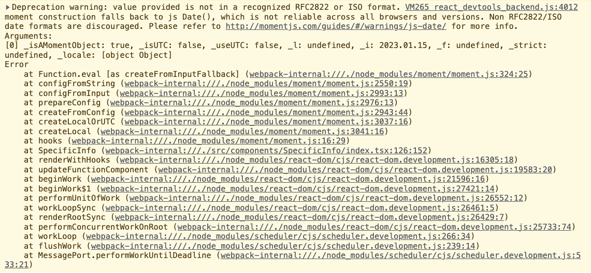

# 모바일 청첩장
## **✨ 배포 링크**
### [배포링크바로가기](https://wedding-invitation-alpha-three.vercel.app/)
### [회고링크바로가기](https://velog.io/@anotherhoon/%EA%B0%9C%EC%9D%B8-%ED%94%84%EB%A1%9C%EC%A0%9D%ED%8A%B8-%EB%AA%A8%EB%B0%94%EC%9D%BC-%EC%B2%AD%EC%B2%A9%EC%9E%A5)

   
  
   

### 카카오톡 SEO

   
  
   

### 카카오톡 공유하기

   
  
   

### 카카오톡 페이

   
  
   

### 클립보드 복사하기

   
  
   

## 마주했으나 끝내 극복한 에러

iOS환경에서만 렌더링이 되지 않았던 이슈

  내가 사용하는 맥북과 android 모바일 환경에서는 잘 렌더링 되었다. 
  하지만 친구들에게 공유하면서 아이폰, 아이패드 (iOS환경)에서는 아래와 같은 에러가 발생하였다.
  
   
  see the browser console for more information에서 힌트를 얻을 수 있을 것 같았고,  모바일 환경에서 개발자 도구 및 console의 메세지를 확인 할 수 있는 방법을 알아냈다. 그리고 invalidDate 에러를 확인 할 수 있었다.
  
   
  그리고 웹 브라우저 console에서도 비슷한 에러를 발견했다.
  
   
  구글링을 통해 <a href='https://string.tistory.com/32'>JavaScript Date객체</a>사용시 크로스 브라우징 이슈가 발생할 수 있음을 알게 되었다.  
  그래서 기존의 데이터를   "weddingDate" : "2023.01.15"에서 "weddingDate" : "2023/01/15" 로 바꾸니 크로스 브라우징 이슈가 해결되었다.
  

##  **🌱 commit message 규칙**

커밋 규칙

⭐ feat : 새로운 기능에 대한 커밋

🎨 ui : 새로운 CSS관련 디자인에 대한 커밋

🛠 fix : 버그 수정에 대한 커밋

🧱 build : 빌드 관련 파일 수정에 대한 커밋

👏 chore : 파일 이동, 파일명 수정, 변수 제거 등의 자잘한 수정에 대한 커밋

⚒ refactor : 코드 리팩토링에 대한 커밋

📝 style : 공백 제거와 같은, 코드 스타일 혹은 포맷 등에 관한 커밋

✏ docs : 문서 수정에 대한 커밋

💡 ci : CI관련 설정 수정에 대한 커밋

## 📚 사용 Library

Lib List

### production
- next.js
- react
- next-seo
- styled-components
-  react-kakao-maps-sdk
- react-responsive-carousel
- react-calendar

